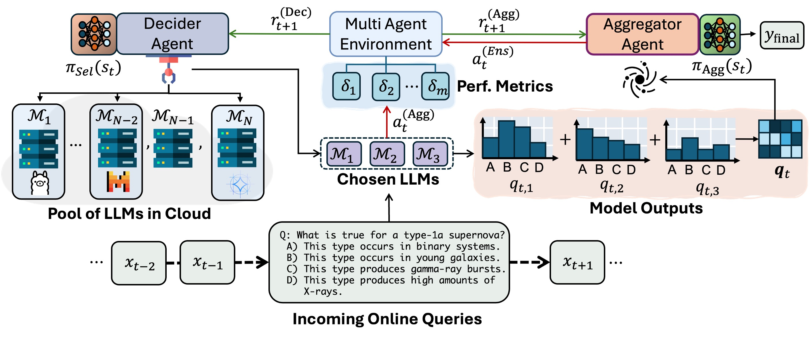

# Multi-Agent Reinforcement Learning with Focal-Diversity Optimization



## Install

```
$ pip install requirements.txt
```


## Basemodel Outputs for MMLU and GSM8k

The inference on MMLU and GSM8k datasets by the following models can be downloaded from the link below and must be put in `data/` folder. 
```
['Llama-2-13b-chat-hf', 'Llama-2-70b-chat-hf', 'Mistral-7B-Instruct-v0.2', 'Mixtral-8x7B-Instruct-v0.1', 'gemma-2b', 'gemma-7b', 'phi-2']
```

```
https://drive.google.com/file/d/10p4Wh50ZCDnoocB5a3XsJivYLJ6uvF6w/view?usp=sharing
```


## Run

You can run MARL-focal using run.py on GSM8k dataset by by giving the following arguments:

```
run.py --dataset_type gsm8k --alpha 1 --focal_div_weight 0.3 --fleiss_kappa_weight 0.3 --plurality_voting_weight 0.3
```

Here we are using three diversity metrics to perform dynamic ensemble pruning with Decider Agent.


You can run for the other datasets "mmlu", "bbh", "gpqa", and "musr" by calling:

```
run.py --dataset_type mmlu_hf --alpha 1 --focal_div_weight 0.5 --fleiss_kappa_weight 0.5
run.py --dataset_type bbh --alpha 0.6 --focal_div_weight 0.5 --plurality_voting_weight 0.5
run.py --dataset_type gpqa --alpha 0.6  --focal_div_weight 0.3 --fleiss_kappa_weight 0.3 --plurality_voting_weight 0.3
run.py --dataset_type musr --alpha 0.6 --focal_div_weight 0.5 --plurality_voting_weight 0.5
```
You must provide Huggingface token inside config.py to run experiments on "bbh", "gpqa", and "musr".
